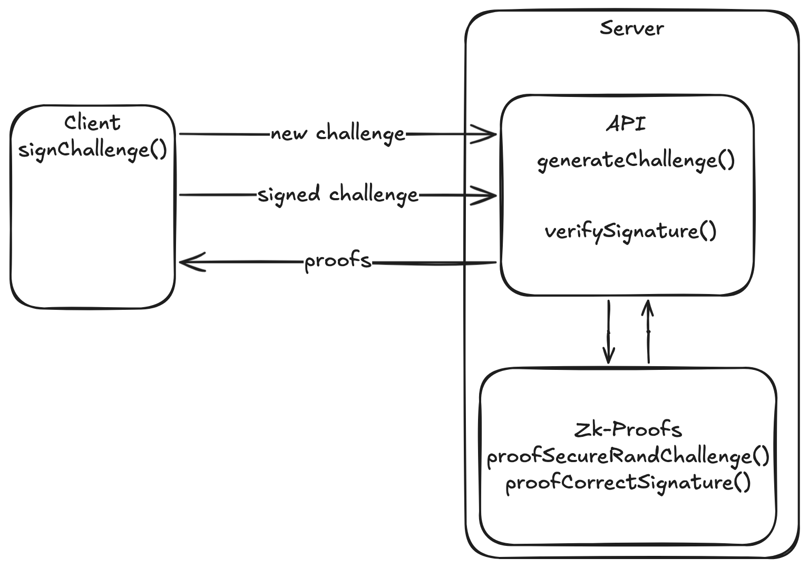
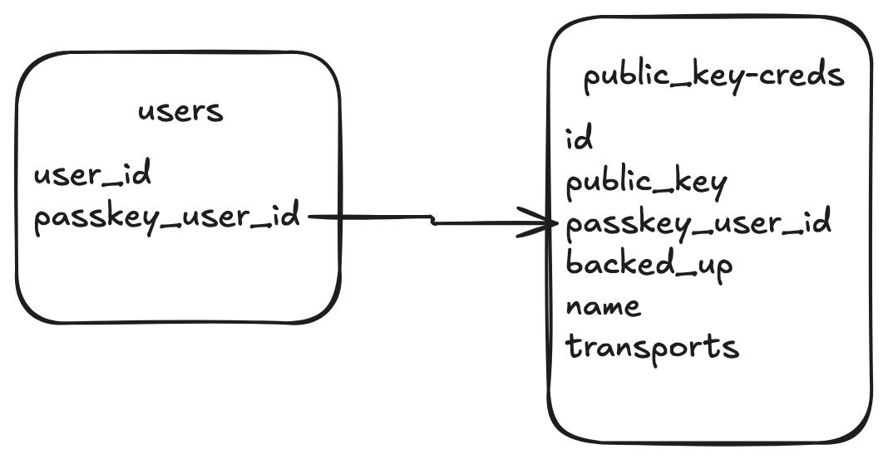

# ZK Passkey Server

The idea here is to have a Passkey relying party that also has zk capabilities. When a challenge is requested, it should also generate a zk proof that that challenge was generated securely and completely random

The server verifies a signature from the client and generates a proof that the signature is valid responding to the client with both proofs

## Registration

Passkey is generated on device and the public key is stored on the server

## Authentication

* Client requests for an authentication challenge from the server and the server also generates a proof to show that the challenge is completely random and unique.
* Client signs the challenge and the signature is verify by the server
* server generates another proof that the signature is valid and returns both proofs to the client.