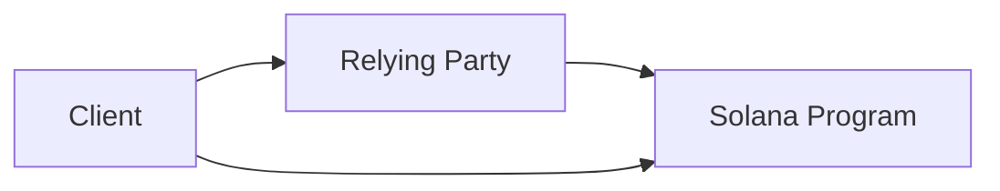
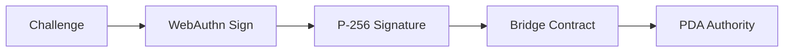
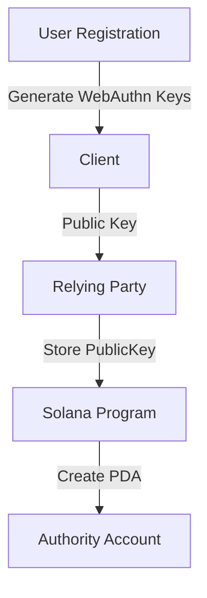
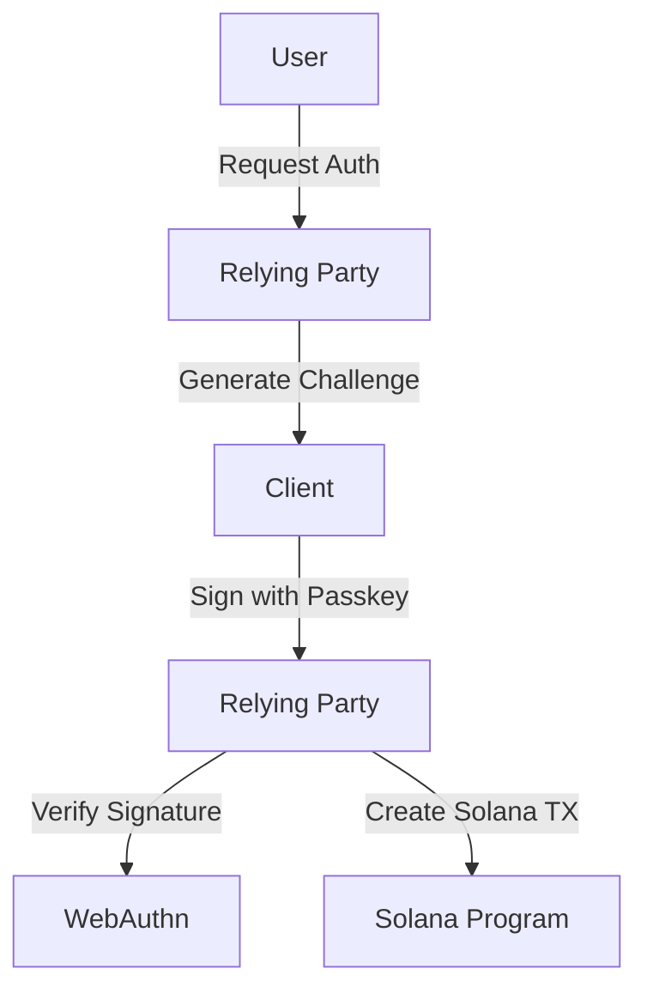
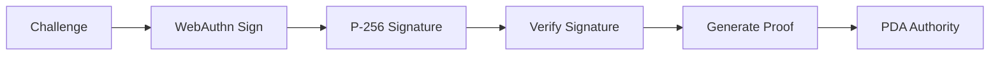

# Passkey <> Solana









## API

### Registration

```json
POST /register/initiate
{
    "username": "string"
}

POST /register/finish/{userId}
{
    "id": "base64",
    "rawId": "base64",
    "response": {
        "clientDataJSON": "base64",
        "attestationObject": "base64"
    },
    "type": "public-key"
}
```

### Authentication

```json
POST /login/initiate
{
    "username": "string"
}

POST /login/finish
{
    "id": "base64",
    "rawId": "base64",
    "response": {
        "clientDataJSON": "base64",
        "authenticatorData": "base64",
        "signature": "base64",
        "userHandle": "base64"
    },
    "type": "public-key"
}
```

## Components

### Database Models

* `User`: stores user info and WebAuthn ID
* `PublicKeyCredential`: stores credential data

The passkey is generated during the finishRegistration handler when the browser responds with the attestation after the user approves the credential creation.

## ZK Component

The idea is to verify the signature on the Solana contract. Since the passkey signature cannot sign an arbitrary message, a ZK proof is proposed to verify the signature.

The server generates a proof that the signature is valid and that the challenge was generated for the current instruction. The proof is then sent to the Solana program which verifies the proof.



## Proof Generation

`input`: challenge, signature, publicKey, instruction \
`output`: proof

* Goal: prove that a given signature `𝜎` is valid for a challenge `c` tied to instruction `I`
* This means:

    1. `𝜎` is a valid signature for `c`
    2. `c` is generated for the instruction `I`

store a mapping of the challenge to the instruction in the database

### Commitment phase

Commit the signature and challenge using a pedersen commitment

```text
Cσ =Commit(σ,rσ)
Cc =Commit(c,rc)
```
Here, `rσ` and `rc` are random values ensuring the commitment is hiding.

### ZK Proof

Prove that the signature is valid for the challenge and that the challenge is generated for the instruction.

* Bulletproofs are used to generate a proof `π` that the signature is valid for the following statement:

  * The prover knows a signature `σ` and a challenge `c` such that `Verify(σ,c) = 1`
  * The prover knows a challenge `c` that is mapped to the instruction `I` with a nonce `Nonce`

* Mathematically, the proof is:

```text
π=Prove(Cσ, Cc, σ, c, rσ, rc, I, Nonce)
```

### Verification

On Solana, the program verifies the proof using the public key of the user.

```text
Verify(π, Cσ,Cc, I, Nonce)
```