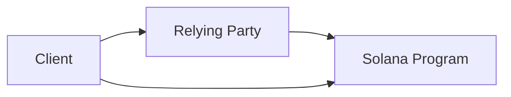
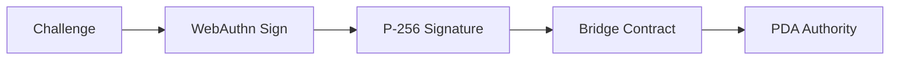
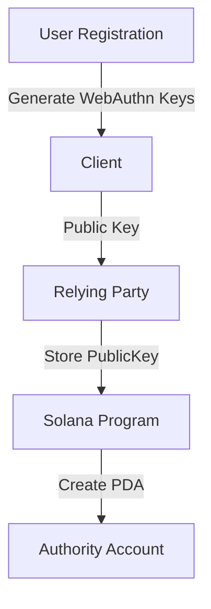
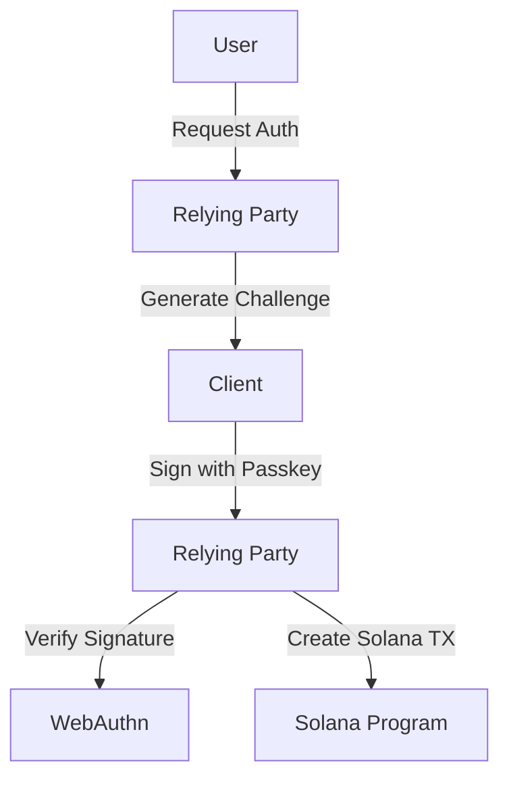

# Passkey <> Solana









## API

### Registration

```json
POST /register/initiate
{
    "username": "string"
}

POST /register/finish/{userId}
{
    // WebAuthn attestation response
    "id": "base64",
    "rawId": "base64",
    "response": {
        "clientDataJSON": "base64",
        "attestationObject": "base64"
    },
    "type": "public-key"
}
```

### Authentication

```json
POST /login/initiate
{
    "username": "string"
}

POST /login/finish
{
    // WebAuthn assertion response
    "id": "base64",
    "rawId": "base64",
    "response": {
        "clientDataJSON": "base64",
        "authenticatorData": "base64",
        "signature": "base64",
        "userHandle": "base64"
    },
    "type": "public-key"
}
```

## Components

### Database Models

* `User`: stores user info and WebAuthn ID
* `PublicKeyCredential`: stores credential data

The passkey is generated during the finishRegistration handler when the browser responds with the attestation after the user approves the credential creation.

